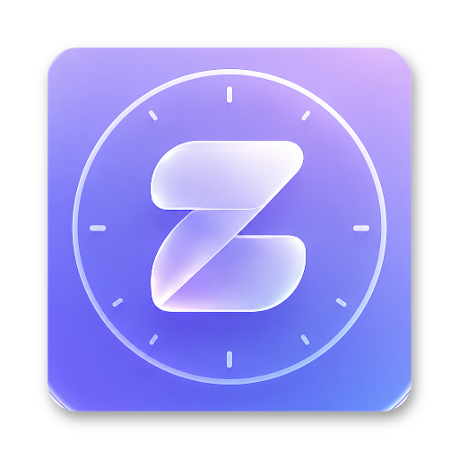
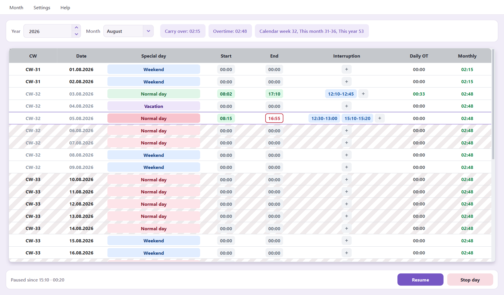
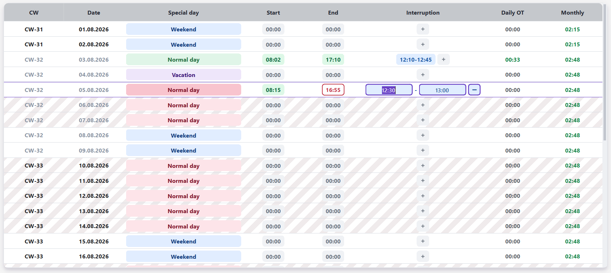
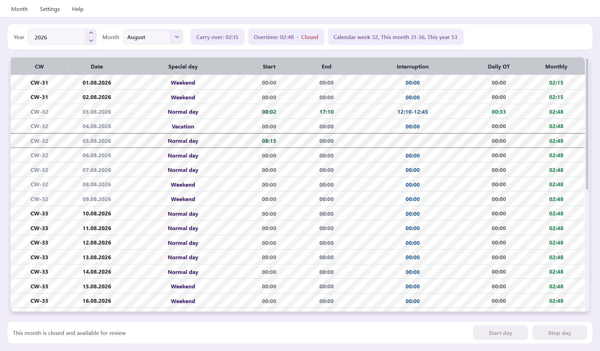

<p align="center">
  
</p>

<h1 align="center">znacTime</h1>

<p align="center">
  A focused, local-first desktop time tracker for workdays, breaks, overtime,
  and reliable monthly records.
</p>

<p align="center">
  
  
  
  <a href="LICENSE"></a>
</p>



## Why znacTime?

znacTime keeps time tracking close to the actual workday. Start, pause, resume,
and stop from one compact control bar while the monthly view calculates daily
overtime, running balance, calendar weeks, and carry-over automatically.

- **Local-first:** SQLite is the authoritative data store on your computer;
  CSV and PDF are explicit export formats.
- **Fast daily controls:** start, pause, resume, and finish a workday without
  navigating away from the month.
- **Flexible breaks:** record a duration or multiple interruption intervals,
  including an active pause that has not ended yet.
- **Expected finish time:** see a non-persisted projected end time based on the
  configured workday duration and recorded breaks.
- **Clear status at a glance:** weekends, special days, missing entries, today,
  and future workdays have distinct visual states.
- **Overtime that carries forward:** daily overtime rolls into the monthly
  balance and can carry over from a closed previous month.
- **Safe monthly close:** archive a month as read-only, add a visible closed
  state, and generate a PDF summary.
- **Comfortable UI:** system, light, and dark themes; adjustable startup sizing;
  keyboard copy and paste; smooth table navigation.

## Main workflows

### Track the day as it happens

The bottom workday bar reflects the current session. A running interruption is
written to the table immediately, so the UI and stored record stay aligned.
The End column can show an outlined expected finish time until the real end is
entered.

### Edit interruptions inline

Double-click an interruption to edit its start and end directly. Multiple
intervals remain separate, their durations are totaled automatically, and
incomplete pauses are clearly represented.



### Review and close a month

Closed months are intentionally non-editable. Badge-like inputs become plain
colored text, the whole month receives a subtle gray archive pattern, the
header displays **Closed**, and the month remains available for review.



## Getting started

### Requirements

- Python 3.10 or newer
- Windows is the primary desktop target

### Install and run

```powershell
git clone https://github.com/ni-sirius/znacTimer.git
cd znacTimer

python -m venv .venv
.\.venv\Scripts\Activate.ps1
python -m pip install -r requirements.txt
python -m znactime
```

You can also launch the application with:

```powershell
python tracker.py
```

## Data and privacy

znacTime does not require an account or cloud service. Its authoritative
`znactime.db` SQLite database lives in the operating system's application-local
data directory. On first launch, choose either a new empty database or a
non-destructive import of the legacy `data/<year>/*.csv` tree. The importer
validates all recognized files before committing and never modifies the source files.

Month status, immutable closed-month results, work schedules, per-day work
limits, clocks, and breaks are stored transactionally in the same database. The timer
pane has no independent state: it derives its state from today's table row and writes
back to that row. Use **Month > Export Month CSV** or **Export PDF** for portable
outputs; exports are not read back as live application state.

Legacy import recognizes only `<root>/<YYYY>/<YYYY>_tmp_<MM>.csv` and matching
`closed_<MM>.flag` files. Symlinks and Windows junctions are rejected. An import is
limited to 2,400 recognized files, 1 MiB per CSV, 64 MiB total, 400 rows per CSV, and
64 KiB per row. Inspection, import, validation, and backup run in cancellable background
workers so the desktop interface remains responsive.

Use **Month > Back Up Database** to create a verified SQLite backup of the full
working history. A normal filesystem copy of `znactime.db` should only be made
while znacTime is closed. Keep the original legacy `data/` directory until the
imported records have been reviewed.

## Settings

Use the **Settings** menu to configure:

- system, light, or dark appearance;
- startup window dimensions and automatic month-height fitting;
- expected workday duration;
- whether projected end times are shown.

### Theme colors

The complete color schemes live in `znactime/ui/qt/themes/light.json` and
`znactime/ui/qt/themes/dark.json`. Both files expose the same properties and
are loaded when the application starts. Within each theme, change `primary`
once to update the shared accent used by controls, focus states, and badges.
Other shared values are defined under `tokens` and reused with references such
as `@tokens.panel_surface`. System appearance automatically selects the light
or dark file.

## Development

The application separates its calculation, storage, and UI layers:

```text
znactime/
├── core/        # time calculations, calendar logic, and semantic models
├── storage/     # SQLite repository, legacy import, and explicit exports
└── ui/qt/       # PySide6 desktop interface
```

See the [SQLite database dictionary](docs/DATABASE_SCHEMA.md) for the purpose of every
table and column, identity/revision rules, and the CSV merge conflict policy.

Run the complete test suite with:

```powershell
.\.venv\Scripts\python.exe -m unittest discover -s tests -v
```

After importing legacy CSV files, verify the current Qt AppData database against
the `data` folder with:

```powershell
.\.venv\Scripts\python.exe scripts\verify_legacy_import.py
```

The verifier opens SQLite read-only, checks the recorded source manifest,
database integrity, every CSV-representable day field and break, month balances,
and immutable closed-month results. Use `--database PATH` for a non-default
database. Exit code `0` means exact parity, `1` means a structural/import error,
and `2` means the import is complete but current SQLite values differ from CSV.

Regenerate the README screenshots with:

```powershell
.\.venv\Scripts\python.exe scripts\generate_readme_screenshots.py
```

On Windows, using the native Qt platform backend produces the clearest text
rendering for screenshots.

## License

znacTime is available under the [MIT License](LICENSE). Qt for Python/PySide6
and other dependencies retain their own licenses; see
[Third-party notices](THIRD_PARTY_NOTICES.md).

## Author and contact

- Website: [znac.org](https://znac.org)
- Email: [znacompany@gmail.com](mailto:znacompany@gmail.com)
